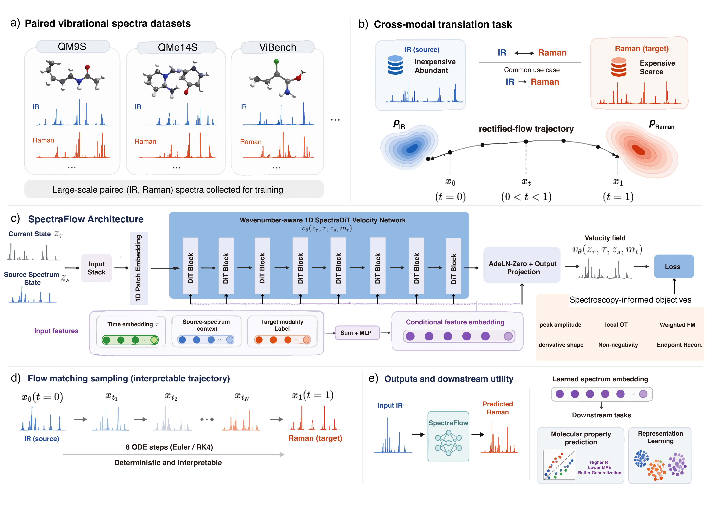

# SpectraFlow

**Spectroscopy-informed Flow Matching for Bidirectional Infrared–Raman Spectral Translation**



SpectraFlow recasts infrared (IR) ↔ Raman spectral translation as a continuous
transport problem. Instead of a direct point-wise regression, it learns a
conditional velocity field with **flow matching** and integrates a deterministic
ODE from the source spectrum to the paired target modality. The velocity field
is a **wavenumber-aware 1D Diffusion Transformer (SpectraDiT)**, and training is
regularized by **spectroscopy-informed** losses that emphasize peaks, edges, and
sharp features.

Because the prediction is produced by integrating an ODE, every intermediate
state along the trajectory is an inspectable spectrum, and the internal
representation at an intermediate flow time doubles as a transferable molecular
embedding for downstream property prediction.

> **Scope of this repository.** This repository contains **code and this
> README only**. Datasets, trained checkpoints, generated results, and the
> manuscript/PDF are intentionally **not** tracked (see `.gitignore`); obtain the
> datasets from their original sources listed at the bottom of this page.

---

## Table of contents

1. [Method highlights](#method-highlights)
2. [Repository structure](#repository-structure)
3. [Installation](#installation)
4. [Data preparation](#data-preparation)
5. [Training](#training)
6. [Evaluation](#evaluation)
7. [SpectraDiT-Direct ablation](#spectradit-direct-ablation)
8. [Downstream representation probing](#downstream-representation-probing)
9. [Analysis and figures](#analysis-and-figures)
10. [Reproducing the paper](#reproducing-the-paper)
11. [Default hyperparameters](#default-hyperparameters)
12. [Datasets and third-party resources](#datasets-and-third-party-resources)
13. [Citation](#citation)

---

## Method highlights

- **Conditional flow matching** for spectrum-to-spectrum generation, trained with
  a straight-line (optimal-transport) interpolation and a constant target
  velocity.
- **Wavenumber-aware 1D SpectraDiT backbone** (`--backbone vibradit`): the
  spectral map is flattened into an ordered wavenumber sequence, divided into
  patches, and processed with self-attention and adaLN-Zero conditioning on flow
  time, target modality, and source spectrum.
- **Spectroscopy-informed objective**: a weighted elastic (L1/L2) velocity loss
  with amplitude / gradient / curvature importance weighting, plus endpoint
  derivative-shape, local optimal-transport, and non-negativity penalties.
- **Deterministic ODE sampling** with Euler (default, 8 steps) or RK4 solvers;
  the full trajectory can be exported for visualization.
- **Baselines** for fair comparison: a convolutional conditional VAE and a
  patch-token **Transformer** translator.
- **SpectraDiT-Direct** ablation: the same SpectraDiT network used for one-pass
  residual prediction (NFE = 1, no ODE integration), isolating backbone capacity
  from iterative transport.

## Repository structure

```
SpectraFlow/
├── src/
│   ├── model_flow.py        # ConditionalFlowMatching + backbones (unet/dit/vibradit)
│   ├── train_flow.py        # Flow-matching training entry point
│   ├── test_flow.py         # Evaluation (MAE/RMSE/R²/Pearson/PSNR/SSIM/JSD, peaks, DTW)
│   ├── train_direct.py      # SpectraDiT-Direct one-pass residual baseline
│   ├── model.py / train.py / test.py            # Conditional VAE baseline
│   ├── model_seq2seq.py / train_seq2seq.py      # Patch-Transformer baseline (train)
│   ├── test_transformer.py                      # Patch-Transformer evaluation
│   ├── process.py           # QM9S CSV -> processed spectra (CSV/H5)
│   ├── process_qme14s.py    # QMe14S ingestion
│   ├── merge_vibench_test_h5.py                 # Build paired ViBench test sets
│   ├── extract_flow_embeddings_and_properties.py# Flow embeddings + RDKit labels
│   ├── train_downstream.py  # Linear/RF probes on features
│   ├── evaluate_peak_resolved_spectra.py        # Peak-resolved fidelity metrics
│   ├── plot_bidirectional_peak_resolved_summary.py
│   └── export_test_smiles.py                    # Export test-split SMILES
├── vibradit_flow.py         # Single-file standalone VibraDiT-Flow implementation
├── analyze_scaffold_performance.py              # Per-scaffold R² breakdown
├── build_scaffold_r2_barplots.py                # Scaffold-class R² bar plots
├── build_fig4_embedding_umap*.py                # UMAP embedding figures
├── build_vibench_ood_downstream_plots.py        # OOD downstream summary plots
├── visualize_flow_matching.py                   # Flow-trajectory illustration
├── run_qm9s_direct.sh       # Launcher for the Direct ablation
├── docs/figure1_overview.png
├── requirements.txt
└── README.md
```

> `data/`, `datasets/`, `checkpoints/`, and `results/` are created at runtime and
> are not tracked. Point the scripts at your own data locations via `--data_dir`.

## Installation

```bash
git clone https://github.com/jiaqingxie/SpectraFlow.git
cd SpectraFlow

python -m venv .venv && source .venv/bin/activate   # Windows: .venv\Scripts\activate
pip install -r requirements.txt
```

RDKit is installed via pip (`rdkit`). If you prefer conda, use
`conda install -c conda-forge rdkit` and install the remaining packages with pip.
A CUDA-enabled PyTorch build is recommended for training; install the matching
wheel from [pytorch.org](https://pytorch.org) for your CUDA version.

## Data preparation

SpectraFlow trains on paired IR/Raman spectra from three benchmarks:

| Dataset  | Molecules | Spectral length `L` | Map size | Role |
|----------|-----------|---------------------|----------|------|
| QM9S     | 129,817   | 3600                | 60×60    | In-distribution |
| QMe14S   | 186,102   | 3600                | 60×60    | Larger / more diverse in-distribution |
| ViBench  | 129,218   | 1024                | 32×32    | Multi-domain benchmark; OOD generalization |

The data pipeline expects each spectrum resampled to a fixed length (`3600` for
QM9S/QMe14S, `1024` for ViBench) and reshaped into a square single-channel map.
Every spectrum is min–max normalized per sample.

**QM9S** — from raw broadened CSVs (rows = spectra, first row = wavenumber axis):

```bash
python src/process.py \
  --data_dir /path/to/qm9s_raw \
  --output_dir data/processed \
  --h5_only
```

This produces `data/processed/{ir,uv,raman}_broaden_processed.h5`.

**QMe14S** — use `src/process_qme14s.py` with the QMe14S source files.

**ViBench** — merge the released per-domain test H5 files into paired
IR/Raman sets with `src/merge_vibench_test_h5.py`.

To obtain the SMILES aligned to the exact test-split row order (needed for
scaffold and downstream analysis), use `src/export_test_smiles.py`.

## Training

### SpectraFlow (VibraDiT-Flow)

QM9S, IR → Raman (matches the paper configuration):

```bash
python src/train_flow.py \
  --data_dir data/processed \
  --save_dir checkpoints \
  --source_mode ir --target_mode raman \
  --heatmap_size 3600 --resize_shape 60 60 \
  --batch_size 64 --epochs 100 --learning_rate 2e-4 --seed 1 \
  --backbone vibradit \
  --dit_patch_size 20 --dit_hidden_dim 384 --dit_depth 8 --dit_num_heads 6 \
  --use_mixed_loss --gen_loss_weight 0.5 --gen_loss_prob 0.1 \
  --train_gen_steps 8 --val_num_steps 8
```

Notes:
- `--backbone vibradit` automatically enables the spectroscopy-informed spectral
  losses (`--lambda_shape 0.05`, `--lambda_ot 0.02`, `--lambda_pos 0.01`).
- `--gen_loss_prob` is the endpoint-consistency probability `p` (paper ablates
  `0.1` vs `0.5`; `0.1` is the default setting).
- The best checkpoint (lowest validation reconstruction loss) is written as
  `flow_{src}2{tgt}_vibradit_best_seed{seed}.pt`.
- Reverse direction: swap `--source_mode raman --target_mode ir`.

### Baselines

VAE:

```bash
python src/train.py --data_dir data/processed \
  --source_mode ir --target_mode raman \
  --latent_dim 128 --beta_max 1e-3 --batch_size 32 --learning_rate 4e-4
```

Patch-token Transformer:

```bash
python src/train_seq2seq.py --data_dir data/processed \
  --source_mode ir --target_mode raman \
  --hidden_dim 256 --depth 6 --patch_size 4 \
  --batch_size 32 --learning_rate 4e-4 --epochs 50
```

## Evaluation

```bash
python src/test_flow.py \
  --data_dir data/processed \
  --checkpoint_dir checkpoints \
  --source_mode ir --target_mode raman \
  --heatmap_size 3600 --resize_shape 60 60 \
  --batch_size 32 --seed 1 \
  --backbone vibradit \
  --dit_patch_size 20 --dit_hidden_dim 384 --dit_depth 8 --dit_num_heads 6 \
  --save_dir results/qm9s_flow_ir2raman \
  --no_rk4
```

`test_flow.py` reports MAE, RMSE, R², and Pearson `r`, and (with extended
metrics) PSNR, SSIM, Jensen–Shannon distance, band-constrained DTW, and
peak-matching errors. Evaluation uses `8` ODE steps by default; drop `--no_rk4`
to switch to the RK4 solver. `test_transformer.py` and `test.py` evaluate the
Transformer and VAE baselines with the same metrics.

Peak-resolved fidelity (peak recall/precision, position error, matched-peak
intensity correlation) from saved predictions:

```bash
python src/evaluate_peak_resolved_spectra.py \
  --preds results/qm9s_flow_ir2raman/predictions.csv \
  --targets results/qm9s_flow_ir2raman/targets.csv \
  --output_dir results/qm9s_peak_resolved
```

## SpectraDiT-Direct ablation

`train_direct.py` reuses the exact SpectraDiT velocity network but predicts the
endpoint residual in a single evaluation (NFE = 1, no ODE solver), isolating the
backbone from iterative transport:

```bash
SOURCE_MODE=ir TARGET_MODE=raman EPOCHS=50 BATCH_SIZE=32 ./run_qm9s_direct.sh
```

Checkpoints are saved with a `direct_` prefix and therefore cannot overwrite the
Flow checkpoints. Swap `SOURCE_MODE`/`TARGET_MODE` for the reverse direction.

## Downstream representation probing

Extract Flow embeddings and RDKit descriptor/fingerprint labels aligned to the
test SMILES:

```bash
python src/extract_flow_embeddings_and_properties.py \
  --data_dir data/processed \
  --checkpoint_dir checkpoints \
  --source_mode ir --target_mode raman \
  --backbone vibradit \
  --dit_patch_size 20 --dit_hidden_dim 384 --dit_depth 8 --dit_num_heads 6 \
  --smiles_path data/processed/test_smiles.txt \
  --t_for_embedding 0.5 --embedding_type hidden --embedding_num_steps 8 \
  --output_dir downstream/qm9s_ir2raman
```

Then probe each feature set (IR raw / Raman raw / Flow embedding / Morgan
fingerprint / Flow+FP) with a ridge or random-forest regressor:

```bash
python src/train_downstream.py \
  --feature_dir downstream/qm9s_ir2raman \
  --source_mode ir --target_mode raman \
  --target_property LogP \
  --model_type ridge --num_seeds 5
```

## Analysis and figures

- **Scaffold-class R²:** `analyze_scaffold_performance.py` then
  `build_scaffold_r2_barplots.py`.
- **Embedding UMAPs:** `build_fig4_embedding_umap.py` and the `build_fig4_*`
  companions.
- **OOD downstream summaries:** `build_vibench_ood_downstream_plots.py`.
- **Peak-resolved summary:** `src/plot_bidirectional_peak_resolved_summary.py`.
- **Flow trajectory illustration:** `visualize_flow_matching.py`.

## Reproducing the paper

- All compared models share a fixed-seed random split
  (train/val/test = 0.70/0.15/0.15) via `get_paired_loaders(..., seed=...)`.
  The QM9S split uses seed 2 (90,871 / 19,472 / 19,474 molecules).
- Main-table numbers are the mean ± s.d. over **4 seeds**; downstream probes use
  **5 seeds**.
- For the OOD study, train only on the ViBench-QM9 source domain and evaluate on
  the held-out domains without per-dataset tuning (same backbone width/depth/heads,
  only the sequence length changes with map size).
- Expected checkpoint names: `flow_{src}2{tgt}_vibradit_best_seed{seed}.pt`.
- The standalone `vibradit_flow.py` reproduces the core training/inference loop
  in a single file if you prefer to run without the `src/` package layout.

## Default hyperparameters

| Group | Hyperparameter | Value |
|-------|----------------|-------|
| Architecture | hidden width `d` | 384 |
| | DiT blocks (depth) | 8 |
| | attention heads | 6 |
| | patch size `P` | 20 |
| | conditioning | adaLN-Zero |
| Optimization | optimizer | Adam |
| | learning rate | 2e-4 (cosine) |
| | weight decay | 0 |
| | batch size | 64 |
| | gradient clipping | 1.0 |
| | epochs | 100 |
| Objective | amplitude / grad. / curv. weights | 1.0 / 0.5 / 0.5 |
| | endpoint / shape / OT / nonneg. weights | 0.5 / 0.05 / 0.02 / 0.01 |
| | endpoint probability `p` | 0.1 |
| Sampling | train-time endpoint ODE steps | 8 |
| | inference ODE steps | 8 |
| | solver | Euler / RK4 |

Values above are the defaults for QM9S; the QMe14S/ViBench runs keep the same
optimization and objective settings and only change map size and patch size.

## Datasets and third-party resources

SpectraFlow does not redistribute any spectra. Please obtain the datasets from
their original sources and cite them accordingly:

- **QM9S** — Zou et al., *A deep learning model for predicting selected organic
  molecular spectra* (Nat. Comput. Sci., 2023).
- **QMe14S** — Yuan et al., *QMe14S* dataset release (2025).
- **ViBench / Vib2Mol** — Lu et al., *Vib2Mol: from vibrational spectra to
  molecular structures* (arXiv:2503.07014, 2025).
- **NIST Chemistry WebBook** — Linstrom & Mallard, NIST Standard Reference
  Database Number 69, DOI: 10.18434/T4D303 (experimental IR inputs).
- **OpenSpecy** — Cowger et al., *Anal. Chem.* 93, 7543–7548 (2021),
  DOI: 10.1021/acs.analchem.1c00123 (cross-library experimental spectra).
- **RRUFF** — Lafuente et al., *The power of databases: the RRUFF project* (2015),
  DOI: 10.1515/9783110417104-003 (mineral identifiers).

The illustrative Raman-timing benchmark uses **MLatom** (Dral et al., *JCTC* 20,
1193–1213, 2024) with **GFN2-xTB** (Bannwarth et al., *JCTC* 15, 1652–1671, 2019)
Hessians and **PTB** (Grimme et al., *J. Chem. Phys.* 158, 124111, 2023)
polarizability derivatives.

## Citation

If you use SpectraFlow, please cite the accompanying manuscript. A BibTeX entry
will be added here upon publication.
